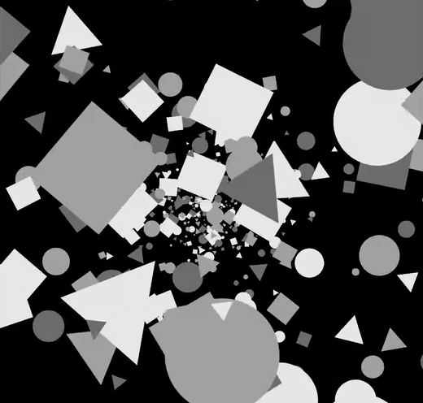
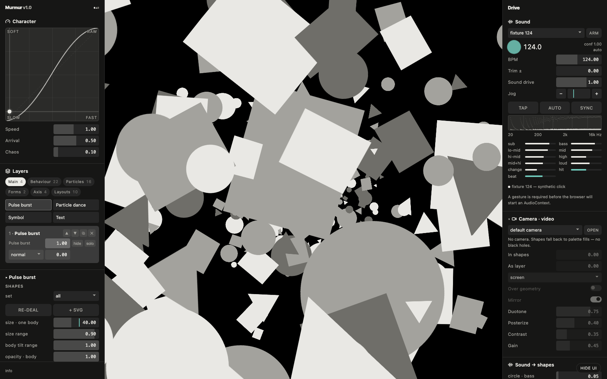
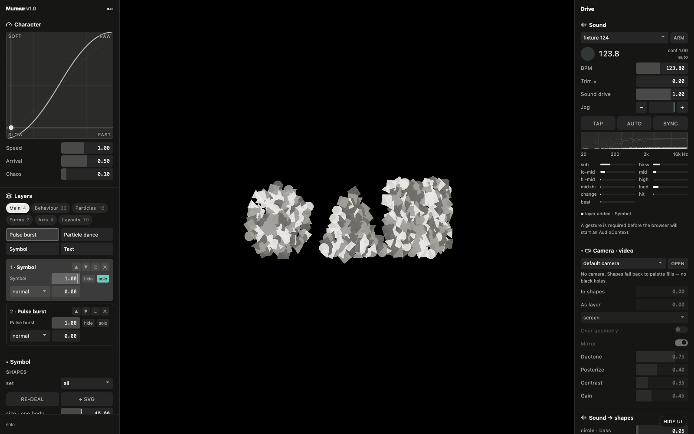

<p align="center">
  
</p>

<h1 align="center">Murmur</h1>

<p align="center">
  A VJ visualizer for DJ sets: circles, triangles and squares that move to your music<br>
  one HTML file · runs in the browser · free and open source
</p>

<p align="center">
  <a href="https://robvagin.github.io/murmur-vj/"><b>Open Murmur</b></a> ·
  <a href="#run-it-locally">Run it locally</a> ·
  <a href="#vibe-coded-by-a-designer">How it was made</a> ·
  <a href="#more-tools">More tools</a>
</p>

---

A murmuration is thousands of starlings moving as one body. Murmur does the same with simple shapes: it listens to the room, finds the beat and moves a field of bodies with the music. Put it on a projector behind the decks and hide the panels.

## What it does

- **Listens.** Live input from a microphone or a line in. Murmur detects the BPM, splits the sound into bands (sub, bass, mids, highs) and feels every hit
- **Moves.** 22 behaviors: swarm, flock, orbit, ripple, shock, jelly, strobe, rain, turbulence, pendulum and more. Each one answers the beat in its own way
- **Builds a set from layers.** Every layer has its own bodies, physics, opacity and blend. Stack them, solo them, hide them
- **Forms.** Bodies gather into a symbol or into any word you type, then scatter again
- **One gesture for character.** A motion pad sets how fast things move and how they arrive; one Chaos knob loosens everything
- **Sound into shapes.** Circles answer the bass, triangles the highs, squares the mids
- **Camera.** Bring a camera in, as a layer or inside the shapes, with duotone, posterize and mirror
- **Your own shapes.** Drop in an SVG or an image and it becomes a body
- **Scenes.** Eight scene slots, export and import as JSON; after a reload, one click brings the last session back

<p align="center">
  
</p>

<p align="center">
  
</p>

## Run it

**In the browser:** open [robvagin.github.io/murmur-vj](https://robvagin.github.io/murmur-vj/), press **ARM** and allow the microphone. Built and tested in Chrome.

### Run it locally

```sh
git clone https://github.com/robvagin/murmur-vj.git
cd murmur-vj
./serve.sh
```

It opens `http://localhost:8931`. The microphone and the camera only work on https or on localhost, so a double-clicked `index.html` will show the shapes but won't hear the room.

No install, no build step, no dependencies: `index.html` and `audio-core.js` are the whole thing.

## Vibe-coded by a designer

I'm a designer. I built Murmur for parties with AI agents: I made the decisions, Claude Code wrote the code. This is the open version of the visualizer I play my own sets with.

Take it if you want it.

## More tools

- [Particle Dance](https://github.com/robvagin/particle-dance) · particles that dance along patterns and 3D forms
- [Orbital](https://github.com/robvagin/orbital) · data as orbits, axes or a bending mesh
- [Metaballs](https://github.com/robvagin/metaballs) · soft masses that merge, split and leave holes
- [Halftone Cloud](https://github.com/robvagin/halftone-cloud) · images rebuilt as a halftone of flying shapes
- [Logomachine](https://github.com/robvagin/logomachine) · seeded generative marks: one seed, one pattern, always
- [Motion Primer](https://github.com/robvagin/motion-primer) · bodies with behaviors: swarm, pack, magnet, orbit, fall, scatter
- [Particles 3D](https://github.com/robvagin/particles-3d) · a WebGL2 cloud of up to 300,000 particles
- [Orb Atom](https://github.com/robvagin/orb-atom) · glass orbs that think: lenses with soft bodies drifting inside
- [Ellipse Sphere](https://github.com/robvagin/ellipse-sphere) · a sphere built from stacked discs that fan open and assemble
- [Thinking Sphere](https://github.com/robvagin/thinking-sphere) · a glass sphere with soft shapes drifting inside
- [SphereGen](https://github.com/robvagin/spheregen) · a glass sphere that bends whatever is behind it: generative scenes, photos, video
- [Line Engine](https://github.com/robvagin/line-engine) · engraved line patterns: superformulas, rosettes, waves and Lissajous, in motion
- [XYZ Cube](https://github.com/robvagin/xyz-cube) · your data as points in a 3D cube on axes you name
- [Hexbin](https://github.com/robvagin/hexbin) · a point cloud counted into 3D hexagon towers
- [Chart 3D](https://github.com/robvagin/chart-3d) · pie, bars, polar and area charts in 3D, with an entrance
- [Sunburst](https://github.com/robvagin/sunburst) · a hierarchy as a 3D sunburst with height
- [Voronoi](https://github.com/robvagin/voronoi) · points that share space as cells, inside any shape
- [Image Shuffler](https://github.com/robvagin/image-shuffler) · your screens flying in 3D, ready to record as a video
- [Motion Pad](https://github.com/robvagin/motion-pad) · one pad for the character of motion

## License

Code: [MIT](LICENSE) © 2026 Robert Vagin. The word formation uses Inter Tight, embedded under the [SIL Open Font License 1.1](fonts/OFL.txt).
